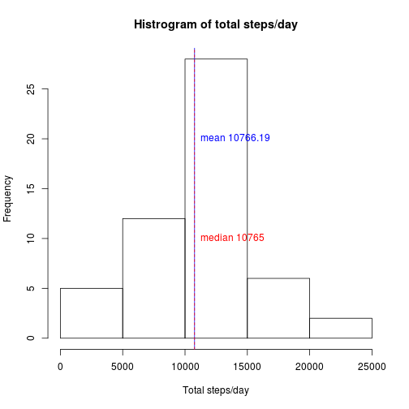

Assumptions:

- The activity.csv data file must be in the working directory.
- The *dplyr* library must be installed.
- The *Hmisc* library must be installed.

## Loading and preprocessing the data

```r
library(dplyr)
activity <- read.csv("activity.csv")
complete <- subset(activity,complete.cases(activity))
stepsByDay <- summarise(group_by(complete, date),sum(steps))
    colnames(stepsByDay)[2] <- "steps"
hist(stepsByDay$steps, xlab = "Total steps/day", main = "Histrogram of total steps/day")
    abline(v=mean(stepsByDay$steps), col="blue")
    abline(v=median(stepsByDay$steps), lty=2, col="red")
    text(mean(stepsByDay$steps),20,labels=paste("mean", round(mean(stepsByDay$steps), digits = 2)), pos=4, col="blue")
    text(median(stepsByDay$steps),10,labels=paste("median", median(stepsByDay$steps)), pos=4, col="red")
```

 


## What is mean total number of steps taken per day?

```r
mean(stepsByDay$steps)
```

```
## [1] 10766.19
```


## What is the average daily activity pattern?

```r
avgStepsByInterval <- summarise(group_by(complete, interval),mean(steps))
    colnames(avgStepsByInterval)[2] <- "steps"
plot(avgStepsByInterval, type="l", main="Average steps/interval", ylab="avg number of steps")
    maxAvgSteps <- which.max(avgStepsByInterval$steps)
    abline(v=avgStepsByInterval$interval[maxAvgSteps], col="blue")
    text(avgStepsByInterval$interval[maxAvgSteps],round(avgStepsByInterval$steps[maxAvgSteps]), labels=paste("max of", as.character(round(avgStepsByInterval$steps[maxAvgSteps])), "steps at interval", as.character(avgStepsByInterval$interval[maxAvgSteps])), pos=4, col="blue")
```

 


## Imputing missing values

The *Hmisc* library is loaded so the impute() funtion can be used.

```r
library(Hmisc)
```
Calculate the number of missing values:

```r
sum(is.na(activity$steps))
```

```
## [1] 2304
```
Missing values are imputed using the mean number of steps/interval.

```r
newActivity <- activity
newActivity$steps <- impute(newActivity$steps, round(mean(newActivity$steps, na.rm = TRUE)))
```
Compare the histogram with imputed data against original.

```r
stepsByDayImputed <- summarise(group_by(newActivity, date),sum(steps))
    colnames(stepsByDayImputed)[2] <- "steps"
hist(stepsByDayImputed$steps, xlab = "Total steps/day", main = "Histrogram of total steps/day (including imputed data)")
    abline(v=mean(stepsByDayImputed$steps), col="blue")
    abline(v=median(stepsByDayImputed$steps), lty=2, col="red")
    text(mean(stepsByDayImputed$steps),20,labels=paste("mean", round(mean(stepsByDayImputed$steps), digits = 2)), pos=4, col="blue")
    text(median(stepsByDayImputed$steps),10,labels=paste("median", median(stepsByDayImputed$steps)), pos=4, col="red")
```

 

When imputed data is included, the mean decreased slightly. The median decreased slightly more.

## Are there differences in activity patterns between weekdays and weekends?

Here is a panel plot to meet the requirements of the assignment:

```r
complete <- mutate(complete, daytype = ifelse(weekdays(as.Date(complete$date)) %in% c("Saturday","Sunday"), "Weekend", "Weekday"))
meanStepsByDayType <- summarise(group_by(complete, interval, daytype),mean(steps))
    colnames(meanStepsByDayType)[3] <- "steps"
par(mfrow=c(2,1))
    with(filter(meanStepsByDayType, daytype == "Weekend"), plot(interval, steps, type='l', col="red", main="Weekend steps/interval"))
    with(filter(meanStepsByDayType, daytype == "Weekday"), plot(interval, steps, type='l', col="blue", main="Weekday steps/interval"))
```

 

Weekend vs. weekday steps are more easily compared when they are in a combined graph. Although activity starts earlier on weekdays, there is more overall activity on weekends.

```r
par(mfrow=c(1,1))
    with(filter(meanStepsByDayType, daytype == "Weekend"), plot(interval, steps, type='l', col="red", main="Average steps/interval"))
    with(filter(meanStepsByDayType, daytype == "Weekday"), lines(interval, steps, type='l', col="blue"))
    legend("topright", lty = 1, col = c("blue", "red"), legend = c("Weekday","Weekend"))
```

 
